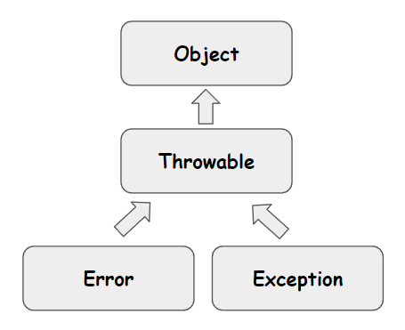
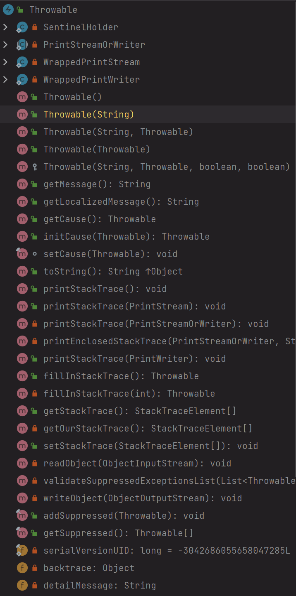

# 예외처리 기본적인 내용들

바빠서 엄청 정성들여서 정리는 못하고 어느 정도 선에서만 요약해둠.

시간 내서 언젠가 확실하게 깔끔하게 정리할 타이밍이 오기를!!!

 

### 참고자료

- [Java 의 Error, Exception, 예외처리 전략](https://toneyparky.tistory.com/40)

- 개인스터디 이펙티브 자바
  - ITEM 70 : 복구할 수 없는 상황예는 검사 예외를, 프로그래밍 오류에는 런타임 예외를 사용하라
  - ITEM 71 : 필요없는 검사 예외 사용은 피하라
  - ITEM 73 : 추상화 수준에 맞는 예외를 던져라
- 개인스터디 / 트랜잭션 개념 정리
  - [스프링의 트랜잭션 AOP 및 커밋,롤백 원칙](https://github.com/gosgjung/study-querydsl-jpa/blob/main/%ED%8A%B8%EB%9E%9C%EC%9E%AD%EC%85%98%20%EA%B0%9C%EB%85%90%EC%A0%95%EB%A6%AC/%EC%8A%A4%ED%94%84%EB%A7%81%EC%9D%98%20%ED%8A%B8%EB%9E%9C%EC%9E%AD%EC%85%98%20AOP%20%EB%B0%8F%20%EC%BB%A4%EB%B0%8B%2C%EB%A1%A4%EB%B0%B1%20%EC%9B%90%EC%B9%99.md)

 

### 상속 다이어그램 (Object, Throwable, Error, Exception)

**Object, Throwable, Error, Exception**

 

### Error, Exception, Throwable

Error

- 시스템이 종료되어야 할 수준의 상황 등과 같은 수습할 수 없는 심각한 문제를 의미
- 개발자가 미리 예측해서 방지하는 것이 불가능
- e.g. 
  - [StackOverflowError](https://docs.oracle.com/en/java/javase/14/docs/api/java.base/java/lang/StackOverflowError.html)
  - [OutOfMemoryError](https://docs.oracle.com/en/java/javase/14/docs/api/java.base/java/lang/StackOverflowError.html)

 

Exception

- 개발자가 구현한 로직에서 발생한 실수, 사용자로 인해 발생
- Error 와는 다르게 개발자가 직접 예측하고 방지가 가능하다.
- 예외처리(Exception Handle)이 가능하다.
- e.g.
  - [NullPointerException](https://docs.oracle.com/en/java/javase/14/docs/api/java.base/java/lang/NullPointerException.html)
  - [IllegalArgumentException](https://docs.oracle.com/en/java/javase/14/docs/api/java.base/java/lang/IllegalArgumentException.html)

 

[Throwable](https://docs.oracle.com/javase/7/docs/api/java/lang/Throwable.html)

- Error, Exception 은 Throwable 클래스를 상속받는다.
- Throwable 클래스의 객체에는 주로 오류, 예외에 대한 메시지를 담는다.
- 또는 예외가 Chaining 될 때 연결된 예외 정보들을 기록하기도 한다.
- Throwable 클래스는 아래 그림에서 보듯이 여러가지 종류의 생성자와 여러가지 메서드 들이 제공된다.

생성자는 여러가지 종류를 쓰겠지만, 번거롭다거나 빠르게 구현이 필요하다면 주로 `Throwable`, `Throwable(String)`, `Throwable(String, Throwable)`, 등을 사용한다. 만약 Java 오픈소스라이브러리를 제공하는데, 다른 라이브러리에서 발생하는 예외 같은 것들을 예외 스택 트레이스로 제공해야 한다면, 조금 더 복잡한 생성자인 `Throwable(String, Throwable)` , `Throwable(String, Throwable, boolean, boolean)` 등과 같은 생성자를 사용하게 될 수 도 있겠다. 

 

### Error 와 Exception 의 차이점

#### Error

- 시스템이 종료되어야 할 수준의 상황 등과 같은 수습할 수 없는 심각한 문제를 의미
- 개발자가 미리 예측해서 방지하는 것이 불가능
- e.g. 
  - [StackOverflowError](https://docs.oracle.com/en/java/javase/14/docs/api/java.base/java/lang/StackOverflowError.html)
    - 호출의 깊이가 깊어지거나 재귀가 지속되어 StackOverFlow 발생시 던지는 오류
  - [OutOfMemoryError](https://docs.oracle.com/en/java/javase/14/docs/api/java.base/java/lang/StackOverflowError.html)
    - JVM의 메모리 부족으로 인해 더 이상 객체를 할당할 수 없을 때 던지는 오류
    - Garbage Collector 가 추가적인 메모리를 확보하지 못하는 상황

 

#### Exception

- 개발자가 구현한 로직에서 발생한 실수, 사용자로 인해 발생
- Error 와는 다르게 개발자가 직접 예측하고 방지가 가능하다.
- 예외처리(Exception Handle)이 가능하다.
- e.g.
  - [NullPointerException](https://docs.oracle.com/en/java/javase/14/docs/api/java.base/java/lang/NullPointerException.html)
    - 사용하려는 메서드 또는 참조 필드의 객체가 null 일 경우에 던져지는 예외
  - [IllegalArgumentException](https://docs.oracle.com/en/java/javase/14/docs/api/java.base/java/lang/IllegalArgumentException.html)
    - 허용되지 않는 메서드이거나 부적절한 argument 를 가지는 경우에 던져지는 예외

 

### CheckedException, UncheckedException, Error

보통은 Checked Exception 이더라도, 추상화 수준에 따라서 그 수준에 맞는 예외를 던지는 것이 좋다. Checked Exception 이더라도 실제 구현상의 추상화 레벨에 맞는 Unchecked Exception 으로 번역해서 예외를 던지면 좋다. 또한, 롤백이 수행되어야 하는 예외일 경우에도 이렇게 Unchecked Exception 으로 예외를 번역한다면 좋다. 

**참고**

이펙티브 자바

- Item 71 - 필요없는 검사 예외 사용은 피하라
- Item 73 - 추상화 수준에 맞는 예외를 던져라.

 

개인 스터디

- [스프링의 트랜잭션 프록시, 커밋, 롤백 원칙](https://github.com/gosgjung/study-querydsl-jpa/blob/main/%ED%8A%B8%EB%9E%9C%EC%9E%AD%EC%85%98%20%EA%B0%9C%EB%85%90%EC%A0%95%EB%A6%AC/%EC%8A%A4%ED%94%84%EB%A7%81%EC%9D%98%20%ED%8A%B8%EB%9E%9C%EC%9E%AD%EC%85%98%20AOP%20%EB%B0%8F%20%EC%BB%A4%EB%B0%8B%2C%EB%A1%A4%EB%B0%B1%20%EC%9B%90%EC%B9%99.md)

 

#### CheckedException

- 복구가 가능한 예외로 여긴다.
- **컴파일 타임에** 예외가 처리될 수 있게끔 `try ~ catch` 구문으로 예외 처리 구문을 작성해줘야 한다.
- 즉, **컴파일 타임에 예외 발생시 어떤 처리를 할 지 예외 처리 구문을 작성**해줘야 한다.
- 만약 예외를 catch 하지 않고, 상위 호출단으로 전가시키려면 `throws` 예약어를 사용한다.
- `Exception` 클래스를 상속받는 클래스 들은 CheckedException 으로 분류된다.
- 스프링에서는 CheckedException 에 대해 기본적으로 롤백을 하지 않는것이 기본 옵션이다.

 

**체크드 익셉션(Checked Exception)의 단점**

하지만, 가급적이면 체크드 익셉션은 자주 사용되면 안된다. Java8 에서부터 스트림 안에서 체크드 익셉션 메서드는 사용할 수 없고, 체크드 익셉션 하나를 처리하기 위한 메서드를 처리하기 위한 상위단의 메서드들을 오염시킨다는 점에서 체크드 익셉션은 좋지 않은 방식이다.([Item 71. 필요없는 검사예외 사용은 피하라](https://github.com/gosgjung/study-effective-java-3rd/blob/master/ITEM-71-%ED%95%84%EC%9A%94%EC%97%86%EB%8A%94-%EA%B2%80%EC%82%AC-%EC%98%88%EC%99%B8-%EC%82%AC%EC%9A%A9%EC%9D%80-%ED%94%BC%ED%95%98%EB%9D%BC.md))

 

#### UncheckedException

- 컴파일 타임에 예외가 발생할지 확실하지 않기때문에, 컴파일 타임에 예외를 `try ~ catch` 하지 않아도 컴파일이 된다.
- 즉, 예외를 명시하지 않아도 된다.
- 컴파일 시점에 예외가 발생하는지 여부를 판단할 수 없다.
- 스프링 프레임워크에서는 에서는 Unchecked Exception 발생시 트랜잭션을 롤백 하는 것을 기본 원칙으로 하고 있다.

 

#### Error

- 에러 발생시 트랜잭션이 롤백된다.
- 복구가 불가능한 상황은 커밋이 될수 없어야 하기에 트랜잭션을 롤백한다.
- 복구가 불가능한 예외로 여긴다.

 

